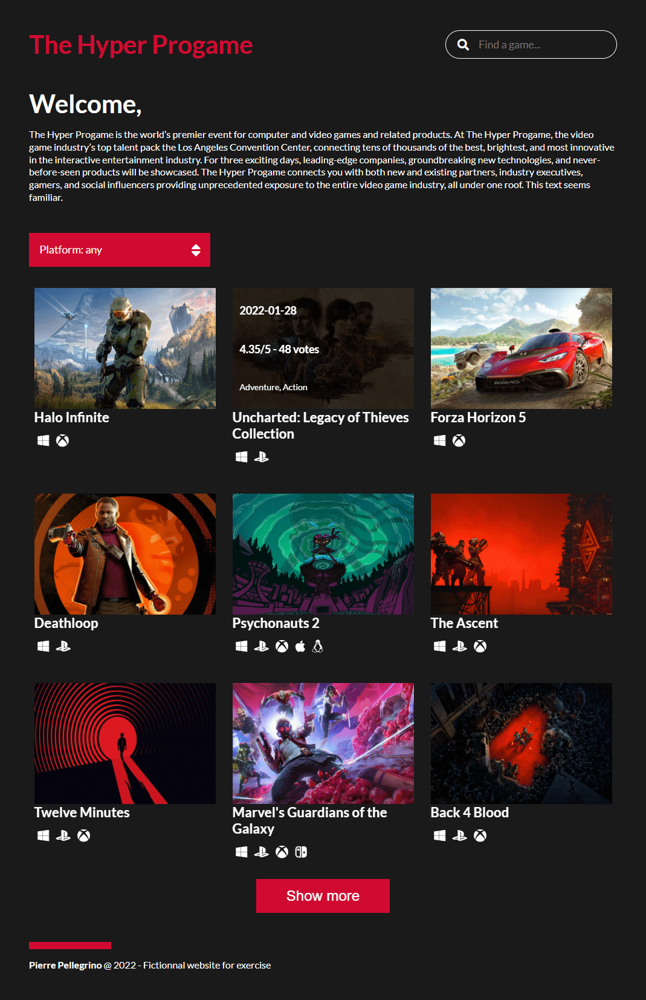
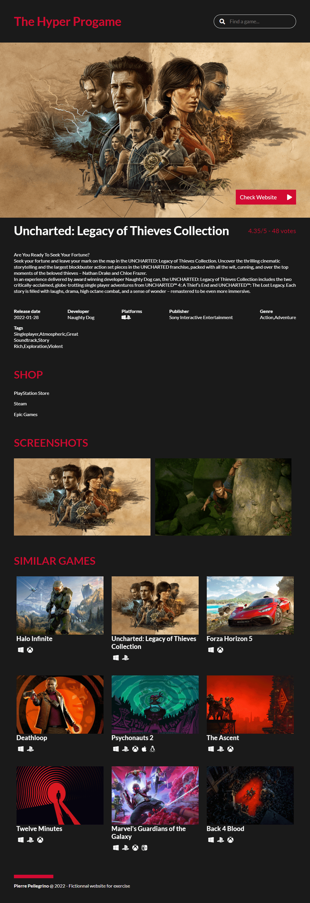

# The Hyper Progame
[Essayer le site en live](https://pierre-pellegrino.github.io/Gaming-Website)

Site de référencement de jeux vidéo dont je n'ai pas choisi le nom.

Projet découverte de npm et Webpack.

## Ressources

 - [API RAWG](https://rawg.io/apidocs)
 - [Create App](https://createapp.dev/webpack)

## Features

- Affichage des jeux récents les plus populaires
- Bouton "Show More" pour afficher plus de jeux
- Recherche d'un jeu par nom
- Tri des jeux par :
    - Console
    - Développeur
    - Éditeur
    - Genre (Aventure, Action...)
- Affichage d'informations détaillées sur un jeu en cliquant sur son titre :
    - Informations générales (date de sortie, développeurs, éditeurs...)
    - Stores sur lesquels l'acheter
    - Captures d'écran
    - Trailers vidéo
    - Jeux similaires basés sur le genre du jeu
- Affichage responsive mobile / tablette / grand écran

## Captures d'écran

